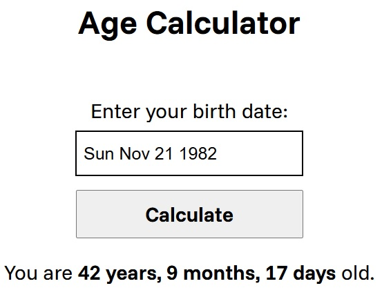

  <h1 align="center">
    Age Calculator
  </h1>

 

# Objective
The goal of this project is to help you learn about how to use external packages using npm. The user inputs their birthdate via a JavaScript Datepicker, and the app calculates and displays their exact age, including years, and months using Luxon.
 
 

# README
https://roadmap.sh/projects/age-calculator
 
 

# PREVIEW

 

# Auxiliary Resources
<ul>
  <li>
    <a href="https://www.npmjs.com/package/js-datepicker#installation" alt="js-datepicker">js-datepicker</a>
  </li>
  <li>
    <a href="https://github.com/moment/luxon/?tab=readme-ov-file" alt=Github - Luxon">Github - Luxon</a>
  </li>
  <li>
    <a href="https://developer.mozilla.org/en-US/docs/Web/JavaScript/Reference/Global_Objects/Date" alt=MDN Web Docs - Date">MDN Web Docs - Date</a>
  </li>
  <li>
    <a href="https://developer.mozilla.org/en-US/docs/Web/JavaScript/Reference/Global_Objects/Object/entries" alt="MDN Web Docs - Object.entries()">MDN Web Docs - Object.entries()</a>
  </li>
</ul>
